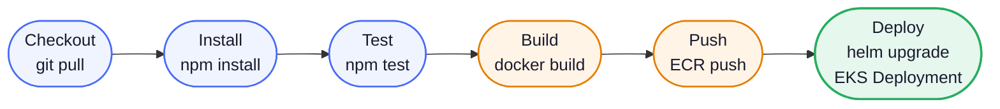
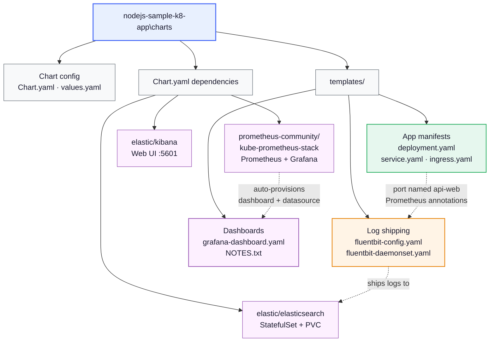
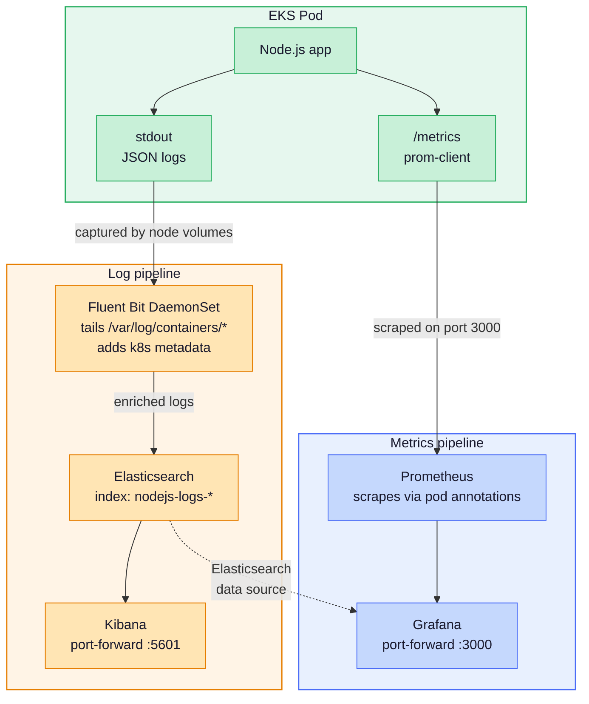

# nodejs-sample-k8-app

Production-ready Node.js application deployed on AWS EKS via Helm, with a full observability stack baked into the chart.

| Layer | Tool |
|---|---|
| Application | Node.js + Express + `prom-client` |
| Container registry | Amazon ECR |
| Orchestration | Amazon EKS |
| Deployment | Helm 3 |
| Log collection | Fluent Bit (DaemonSet) |
| Log storage + search | Elasticsearch + Kibana |
| Metrics | Prometheus (kube-prometheus-stack) |
| Dashboards | Grafana (auto-provisioned) |
| CI/CD | Jenkins (Groovy declarative pipeline) |

---

## CI/CD Pipeline



---

## Helm Chart Structure



---

## Observability Data Flow



> Grafana has two data sources out of the box: Prometheus for metrics and Elasticsearch for logs. No manual setup needed after `helm upgrade --install`.

---

## Directory Structure

```
nodejs-docker-example/
├── charts/
│       ├── Chart.yaml                      # App + ELK + Grafana dependencies
│       ├── values.yaml                     # All configuration
│       └── templates/
│           ├── deployment.yaml             # api-web named port, Prometheus annotations
│           ├── service.yaml                # targetPort: api-web
│           ├── ingress.yaml                # AWS ALB
│           ├── fluentbit-config.yaml       # Log pipeline: tail → K8s filter → ES
│           ├── fluentbit-daemonset.yaml    # DaemonSet + RBAC
│           ├── grafana-dashboard.yaml      # Pre-built Node.js dashboard ConfigMap
│           └── NOTES.txt
├── Dockerfile                              # Multi-stage, non-root
├── index.js                                # Express app + /metrics endpoint
├── package.json
├── test.js                                 # Smoke test (used by Jenkins)
└── Jenkinsfile                             # Full CI/CD pipeline
```

---

## Quick Start (local)

```bash
npm install
npm start
# App     → http://localhost:3000
```

---

## AWS Pre-requisites

1. **ECR repository** – create it once:
   ```bash
   aws ecr create-repository --repository-name nodejs-sample-k8-app --region us-east-1
   ```

2. **EKS cluster** – with the [AWS Load Balancer Controller](https://docs.aws.amazon.com/eks/latest/userguide/aws-load-balancer-controller.html) installed (required for Ingress/ALB).

3. **Jenkins credentials** – add your AWS IAM key pair under the ID `aws-credentials-id`.

4. **Update `values.yaml`** – replace the placeholder ECR URL:
   ```yaml
   image:
     repository: <AWS_ACCOUNT_ID>.dkr.ecr.<REGION>.amazonaws.com/nodejs-sample-k8-app
   ```

5. **Update `Jenkinsfile`** – set `AWS_REGION`, `AWS_ACCOUNT_ID`, `EKS_CLUSTER_NAME`.

---

## Manual Helm Deployment

```bash
# Add repos
helm repo add elastic              https://helm.elastic.co
helm repo add prometheus-community https://prometheus-community.github.io/helm-charts
helm repo update

# Pull sub-chart tarballs
helm dependency build ./charts/nodejs-sample-k8-app

# Lint
helm lint ./charts/nodejs-sample-k8-app

# Deploy
helm upgrade --install my-nodejs-app ./charts/nodejs-sample-k8-app \
  --namespace default \
  --create-namespace \
  --set image.repository=<ECR_URI> \
  --set image.tag=<BUILD_NUMBER> \
  --atomic --wait
```

---

## Observability

### Accessing the UIs

```bash
# Kibana (index pattern: nodejs-logs-*)
kubectl port-forward svc/my-nodejs-app-kibana 5601:5601

# Grafana (admin / changeme-in-production)
kubectl port-forward svc/my-nodejs-app-kube-prometheus-stack-grafana 3000:80
```

Kibana index pattern: `nodejs-logs-*` | Time field: `@timestamp`

---

## Key Design Decisions

- **Named port `api-web`** — the container port in `deployment.yaml` is named `api-web`; `service.yaml` references it via `targetPort: api-web` so service routing isn't coupled to a hardcoded port number.
- **Fluent Bit as DaemonSet** — runs on every EKS worker node so there's no per-pod sidecar overhead. Logs are captured at the host level from `/var/log/containers/*`.
- **Grafana auto-provisioning** — both the Elasticsearch data source and the Node.js metrics dashboard are declared in `values.yaml`, so the Grafana UI is ready to use immediately after deploy with no manual configuration.
- **`--atomic` flag** — if any resource in the Helm release fails to reach a ready state, Helm automatically rolls back to the previous release, keeping the cluster in a known-good state.
- **Multi-stage Dockerfile** — the build stage installs dependencies; the runtime stage copies only the production artifacts and runs as a non-root user, keeping the image lean and reducing attack surface.
